

  <!-- Reemplaza la ruta de abajo con tu logo principal -->
  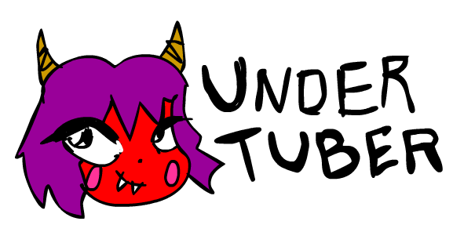

  
<em>The YouTube Underground Search Engine</em>

---

Undertuber is an extension and website I created to bypass the youtube constant algorithm videos (influencers and video essays, you know what I mean) and search cool underground videos on the platform.

This tool strips away algorithmic recommendations to uncover forgotten home videos, raw camera dumps, obscure test logs, and the truly weird side of the internet.

  <!-- Reemplaza esta ruta con tu imagen de la cuadrícula de botones -->
  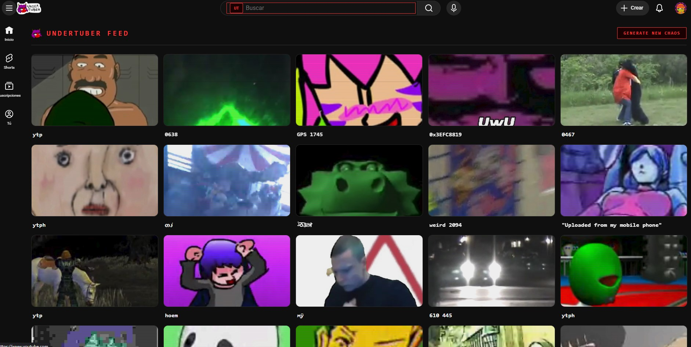

## 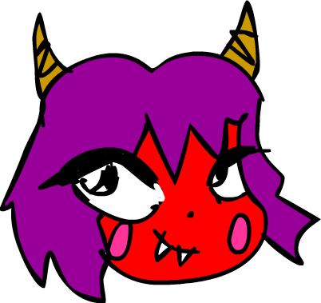 Key Features

* **Search Bar Hijack:** Intercepts native YouTube searches and injects modifiers (dates, entropy, exact match) before the query is processed. Entropy stand for 3 randomize letters on search so everytime is different.

  <!-- Reemplaza esta ruta con tu imagen de la cuadrícula de botones -->
  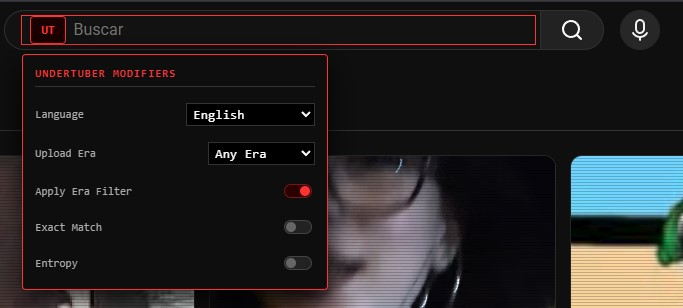

* **Feed & Sidebar Replacement:** Destroys YouTube's highly-curated homepage and related videos, replacing them with generative "Void Cards" that refresh with every click. This one can be customize and also add your own words so its can be different everytime. The cool thing about the sidebars is that is related to the video you are watching too!
  

  <!-- Reemplaza esta ruta con tu imagen de la cuadrícula de botones -->
  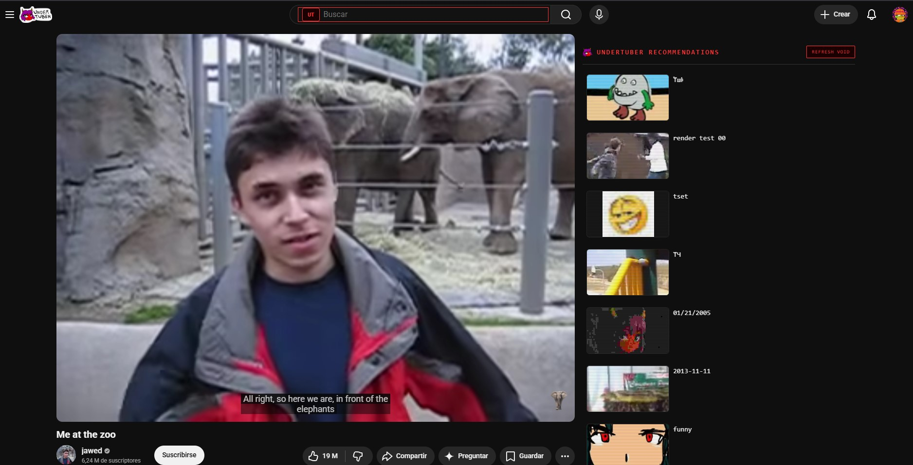

* **13 Button Generators:** One-click automated search queries designed to find specific types of obscure media. If you only want to watch random stuff with your friends this is the best!
* **Era Enforcement:** Force searches and feeds to only pull videos from specific timeframes (e.g., 2005-2009, 2010-2013). Go to the past! Now!
  

  <!-- Reemplaza esta ruta con tu imagen de la cuadrícula de botones -->
  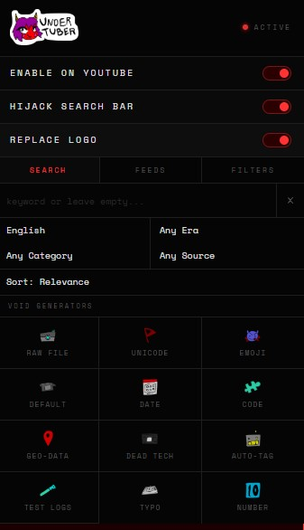

  
* **Custom Vocabulary Integration:** Inject your own custom word lists with optional "Exact Quotes" enforcement to different searches. This brings personalize recomendations of things you want!
* **Local Image Pool:** Option to use up to 9,999 local images (`/img/1.png`, etc.) for feed thumbnails to maintain immersion. Add memes, anime chicks or whatever your eyes are pleased instead of an influencer or X million video essay of how many vertices does Mario 64 have!

  <!-- Reemplaza esta ruta con tu imagen de la cuadrícula de botones -->
  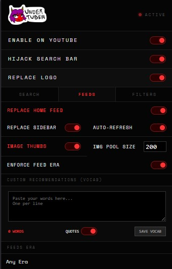

---

##  The Void Generators Buttons

Undertuber has 13 buttons to pull specific data structures from YouTube.

  <!-- Reemplaza esta ruta con tu imagen de la cuadrícula de botones -->
  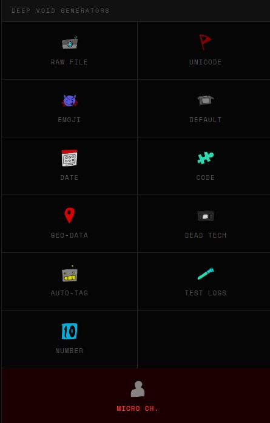

* 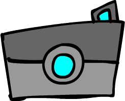 **Raw File:** `IMG_`, `MVI_`, `DSCN` followed by sequential digits.
* 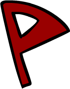 **Unicode:** Random obscure unicode blocks to find untagged foreign media.
* 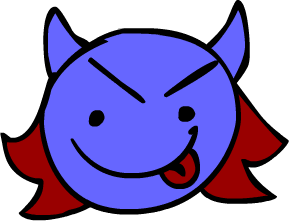  **Emoji:** Completely random emoji combinations.
* 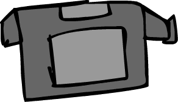  **Default:** "Untitled video", "test", "my movie".
*   **Date:** Randomly generated past upload dates (`YYYYMMDD`, `MM/DD/YY`).
* 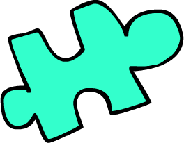  **Code:** Random Hex, Base64 strings, or memory addresses.
* 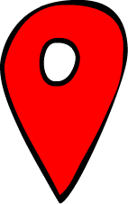  **Geo-Data:** Random GPS coordinates and Lat/Lon tags.
* 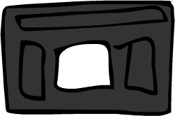  **Dead Tech:** Legacy formats and hardware (`.rmvb`, `Amiga 500`, `MiniDV`).
* 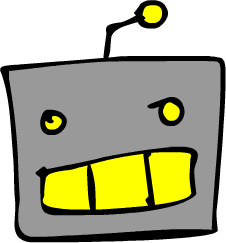  **Auto-Tag:** "Uploaded via Pixelpipe", "Sent from my BlackBerry".
* 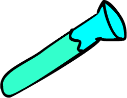  **Test Logs:** "Audio sync test", "webcam test 00", "render test".
* 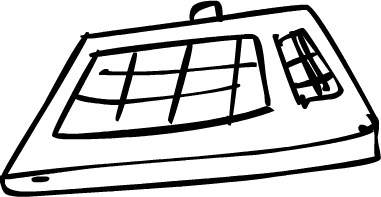  **Typo:** Generates deliberate misspellings of common words.
*   **Number:** Sequential and random 4-digit strings.
*   **Micro Ch.:** Targets extreme amateur channels ("personal vlog", "home lab").

---

##  Installation

Undertuber can be run directly inside YouTube via the Chromum Browser Extension, or remotely via the Mobile-Friendly Website.

### Method 1: Chromium Browser Extension (Desktop)
1. Download or clone this repository.
2. Open Chromium Based Browser and navigate to `yourbrowser://extensions/`.
3. Enable **"Developer mode"** in the top right corner.
4. Click **"Load unpacked"** and select the folder containing the extension files (`manifest.json`, `content.js`, etc.).

  <!-- Reemplaza esta ruta con tu imagen de la cuadrícula de botones -->
  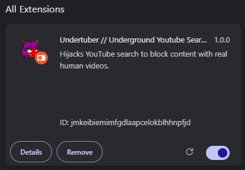

5. Open YouTube. Click the Undertuber (UT) icon in your browser toolbar to access the control panel.

  

  <!-- Reemplaza esta ruta con tu imagen de la cuadrícula de botones -->
  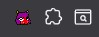

### Method 2: Website (Mobile & Desktop)
1. Go to undertuber.neocities.org in any web browser.
2. Configure your modifiers, select a generator, and click **"OPEN IN YOUTUBE"**.
3. *Mobile Users:* Make sure the "Open in Mobile App" toggle is active to cast searches directly into the native YouTube app on iOS or Android.

 

  <!-- Reemplaza esta ruta con tu imagen de la cuadrícula de botones -->
  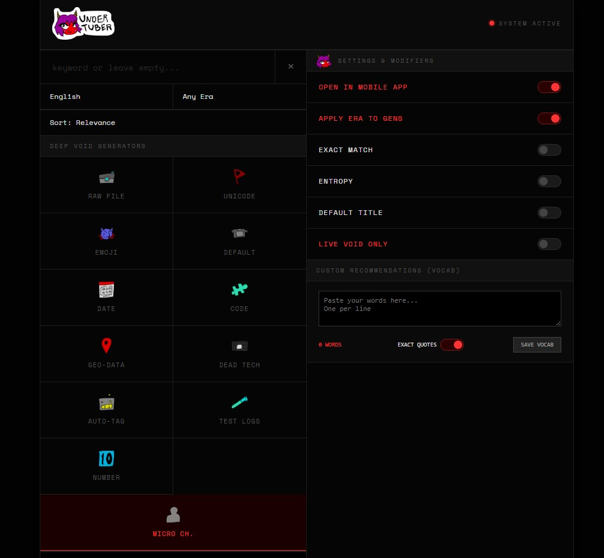

---

##  Project Structure

* `manifest.json` - Chromium extension configuration (Manifest V3).
* `content.js` - The core engine. Runs natively in the YouTube DOM to handle UI injection, feed replacement, and event interception.
* `popup.html` & `popup.js` - The extension control panel.
* `index.html` - The standalone web app terminal.
* `/img/` - Folder for custom local thumbnails (e.g., `1.png`, `2.png`... up to the limit set in the UI).

---

##  Privacy & Execution

Undertuber runs **100% locally**. There are no external servers, no tracking, and no data collection. All custom vocabulary lists and settings are stored locally in your browser's memory (`chrome.storage.local`). The application interacts strictly with YouTube's public search URL parameters.
